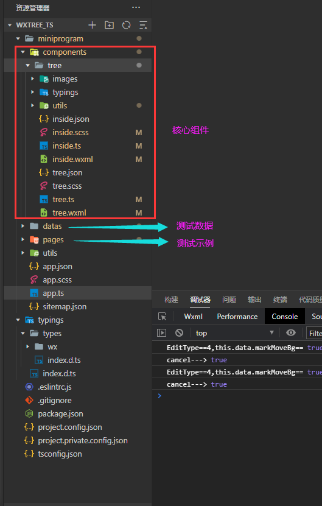
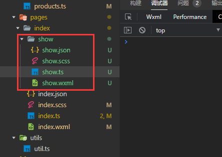
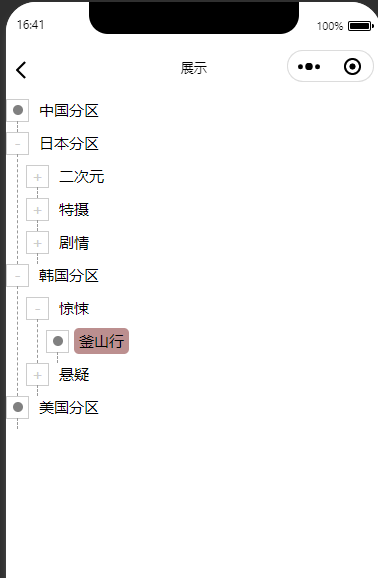
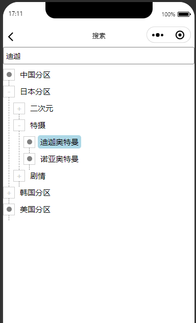

# 简介

> 该指导能够帮助您快速使用该项目,但是你必须满足下面条件:
>
> + 原生微信小程序
> + 官方的TypeScript+Scss模板

# 项目结构

> 直接把components文件夹下面的tree文件夹引入到你的项目即可



# 展示数据

> `测试示例页面:`pages/index/show/show
>
> 

## 引入组件

> .json
>
> ```json
>   "usingComponents": {
>     "wxTree": "../../../components/tree/tree"
>   },
> ```

## 准备数据

> ```js
> const movieList = [
>   {
>     movieId: 1,
>     typeName: '中国分区',
>     parentId: 0
>   },
>   {
>     movieId: 2,
>     typeName: '日本分区',
>     parentId: 0
>   },
>   {
>     movieId: 5,
>     typeName: '二次元',
>     parentId: 2
>   },
>     .....
>   ]  
> ```
>
> 一般后台返回的数据类型和上面类似,至少包括id,name,还有parentId.当然还会有其他字段,但是与树的转化关联不大

## 准备treeOptions配置

> .ts->data:{}
>
> ```ts
>   data: {
>     movieList: [] as Array<any>,
>     treeOptions: {
>       recordTrack: true, //开启点击印记
>       // 这个属性是必须的,目的是描述树结构的配置
>       treeObjProps: {
>         id: 'movieId',//moveList每个对象的唯一标识
>         title: 'typeName',//用于展示树节点的文本
>         fatherId: 'parentId',//moveList每个对象的指针
>       }
>     }
>   },
> ```
>
> treeOptions为了普适性描述树,其中id: 'movieId'是根据具体数据修改,例如你的数据是商品列表,那么id:'productId'

## wxml使用

> ```html
> <wxTree listData="{{movieList}}" options="{{treeOptions}}" bind:nodeClick="nodeClick"></wxTree>
> ```


## 父页面事件监听

> ```ts
>   /**
>    * 获得被点击节点的信息
>    * @param e 
>    */
>   nodeClick(e: WechatMiniprogram.Touch) {
>     console.log('clicked node is ', e.detail)
>   },
> ```


## 显示效果

> 


# 搜索数据

## 引入组件

> ```json
>   "usingComponents": {
>     "wxTree": "../../../components/tree/tree"
>   },
> ```
>
> 

## 准备数据

> ```js
> const movieList = [
>   {
>     movieId: 1,
>     typeName: '中国分区',
>     parentId: 0
>   },
>   {
>     movieId: 2,
>     typeName: '日本分区',
>     parentId: 0
>   },
>   {
>     movieId: 5,
>     typeName: '二次元',
>     parentId: 2
>   },
>     .....
>   ]  
> ```


## 准备treeOptions配置

> ```ts
>   data: {
>     movieList: [] as Array<any>,
>     treeOptions: {
>       searchMode:true, //开启搜索模式
>       recordTrack: true, //开启点击印记
>       treeObjProps: {      // 这个属性是必须的,目的是描述树结构的配置
>       id: 'movieId',//moveList每个对象的唯一标识
>       title: 'typeName',//用于展示树节点的文本
>       fatherId: 'parentId',//moveList每个对象的指针
>       }
>     }
>   },
> ```
>
> ` searchMode:true,`开启搜索模式,搜索模式是防抖搜索


## wxml使用

> ```html
> <wxTree listData="{{movieList}}" options="{{treeOptions}}" bind:nodeClick="nodeClick"></wxTree>
> ```


## 父页面事件监听

> ```ts
>   /**
>    * 获得被点击节点的信息
>    * @param e 
>    */
>   nodeClick(e: WechatMiniprogram.Touch) {
>     console.log('clicked node is ', e.detail)
>   },
> ```


## 显示效果

> 

# 编辑数据

## 引入组件

> ```json
>   "usingComponents": {
>     "wxTree": "../../../components/tree/tree"
>   },
> ```


## 准备数据

> ```ts
> const movieList = [
>   {
>     movieId: 1,
>     typeName: '中国分区',
>     parentId: 0
>   },
>   {
>     movieId: 2,
>     typeName: '日本分区',
>     parentId: 0
>   },
>   {
>     movieId: 5,
>     typeName: '二次元',
>     parentId: 2
>   },
>     .....
>   ]  
> ```
>
> 

## 准备treeOptions配置

> ```ts
>   data: {
>     movieList: [] as Array<any>,
> 
>     treeOptions: {
>       editMode: true, //开启编辑模式
>       // 这个属性是必须的,目的是描述树结构的配置
>       treeObjProps: {
>         id: 'movieId',//moveList每个对象的唯一标识
>         title: 'typeName',//用于展示树节点的文本
>         fatherId: 'parentId',//moveList每个对象的指针
>       }
>     },
> 
>   },
> ```
>
> `editMode: true` 表示开启编辑模式,长按弹出编辑选项

## wxml使用

> ```html
> <wxTree listData="{{movieList}}" options="{{treeOptions}}" bind:nodeClick="nodeClick"></wxTree>
> ```


## 父页面监听事件

> ```ts
>   /**
>    * 获取被点击的节点
>    * @param e 
>    */
>   nodeClick(e: WechatMiniprogram.Touch) {
>     const node = e.detail
>     console.log('page choose node:', node)
>   },
> 
> ```
>
> ```ts
>   /**
>    * 获取编辑节点后的结果
>    * @param e 
>    */
>   nodeEditResult(e: WechatMiniprogram.Touch) {
>     console.log('page get Edit result:', e.detail)
>   }
> ```
>
> 


# API

## WxTree Props

| 参数           | 说明                                                         | 类型       | 默认值 | 是否必须 |
| -------------- | ------------------------------------------------------------ | ---------- | ------ | :------: |
| listData       | 构建树的数组,该数组可以是未成形的树,也可以是成形的树.对于未成形的树,数组每个对象的结构必须有指针关系,WxTree内部会做一个转化;如果是已经成形的树,需要配置options对象属性的isTreeConstruct:true,详解options配置 | Array<any> | []     |    是    |
| flatExpand     | 如果设置为true,那么点击节点本身也可以展开or收缩节点.如果设置为false,只能点击加号展开or收缩节点 | boolean    | true   |    否    |
| isShowChildren | 如果设置为true,则树初始化后,就把所有节点全部展开.如果设置为false,则初始时,所有节点全是关闭的 | boolean    | false  |    否    |
| keepAlive      | 是否保存节点展开/收缩状态;如果设置为true,节点展开/收缩的状态将会具有记忆性,设置false,节点展开/收缩不具备记忆性 | boolean    | true   |    否    |
| options        | WxTree的其他配置信息,详见 ==WxTree Props of options==        | object     |        |          |

### WxTree Props of options

> options的数据结构
>
> ```ts
>   interface TreeOptions {
>     [key: string]: any;
>     isTreeConstruct: boolean,  //给定的数组是否已经就是属性结构,默认:false
>     dotBg?: string  //圆点的背景色,#ffffff等十六进制颜色,默认:#808080
>     searchBg?: string //搜索状态下,如果搜索成功了,匹配的节点的背景色(#ffffff等十六进制颜色)
>     clickBg?: string,  //点击节点的背景颜色(recordTrack设为true的时候起作用)
>     recordTrack?: boolean, //是否开启点击印记,true表示开启;默认:false
>     searchMode?: boolean,  //是否开启搜索模式,true代表开启;默认false
>     searchInputCss?:string,  //在searchMode:true下,设置输入框的样式,如果没有这个配置,没关系会有默认样式
>     searchOnlyRelative?:boolean,//在searchMode:true下,设置搜索的节点是否仅仅是父级相关的,默认为false
>     editMode?:boolean,  //是否开启编辑节点模式,true代表开启,默认为false
>     treeObjProps: {
>       id: string,     //tree对象的唯一标识
>       title: string,  //树形UI用于展示的文本
>       fatherId: string, //树的指针,如{id:1001,name:'文本标题',parentId:2,child:[....]},fatherId在此时取'parentId'
>       children?: string //树孩子的名称,例如上行例子,取'child'
>     }
>   }
> ```
>
> 


## WxTree Events

### nodeClick事件

> 在`nodeClick`事件中，可以获取到被点击节点的对象信息

### nodeEditResult事件

> 在`nodeEditResult`事件中，可以获取编辑后的整颗树的信息(需在options,开启editMode:true,生效)

