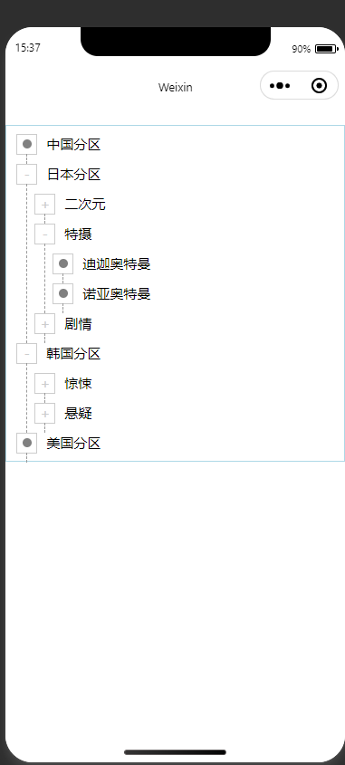
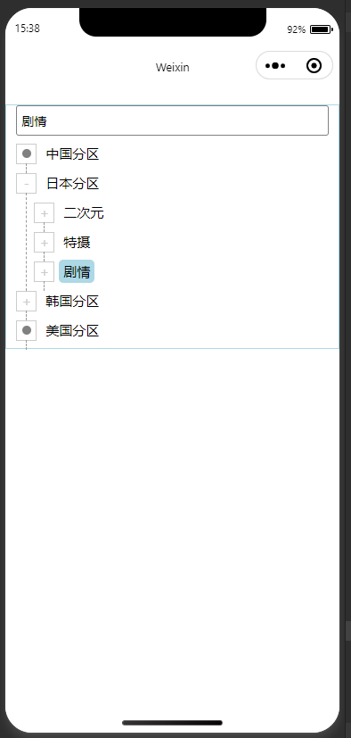
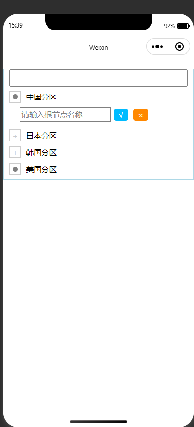
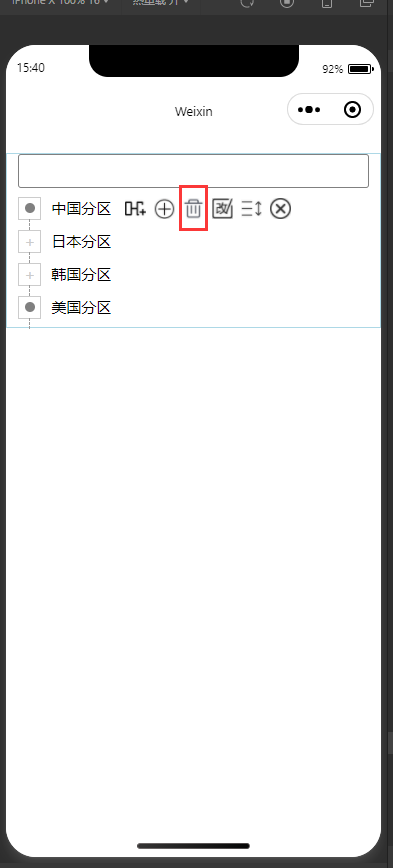
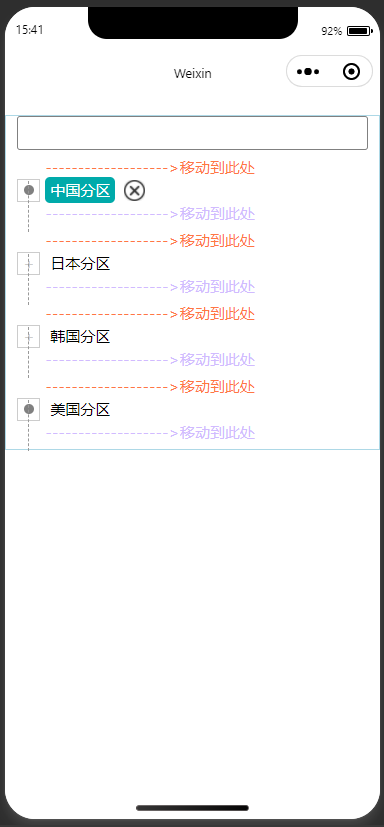
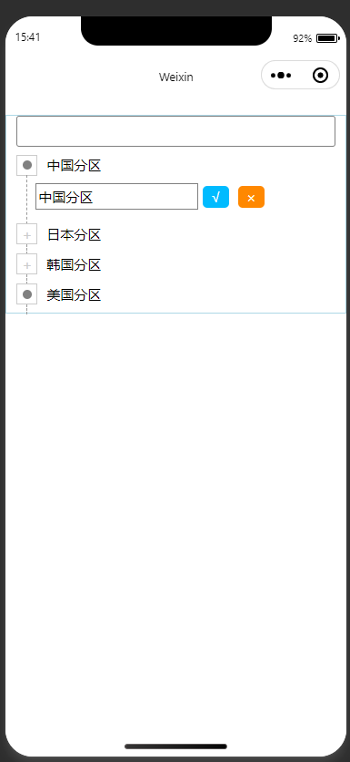

# WxTree项目简介

> 该项目主要是适用微信小程序的一个树形UI,能够把后端的具有指针关系的对象数组通过树的方式展示出来

# 实现技术

+ 原生微信小程序框架
+ TypeScript+Scss

# 使用说明

+ 参考Guide.md

# 项目示例

## 展示数据

## 搜索数据

## 编辑数据

### 增加数据

### 删除数据

### 移动数据

### 修改数据

